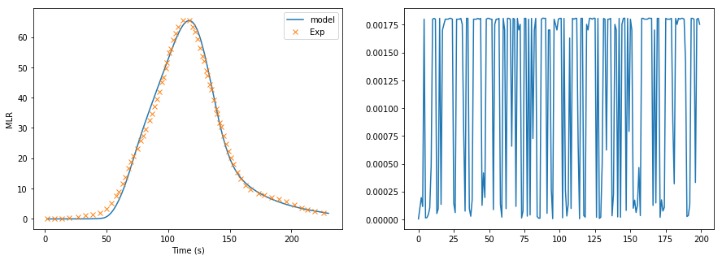

# Parameter-Optimisation-Using-ML

This repository introduces a hybrid method to optimise model parameters to fit testing data using various optimisation algorithms.

### Workflow
1. Normalize testing data
2. Use optimiser to generate updated model parameters
3. Modify the input files using updated parameters
4. Call simulation program and output the predicted result
5. Evaluate the fitness by comparing the predicted result and testing data
6. Repeating steps 2 - 5
7. Output the final parameter when the fitness value is minimized.

In this project, the simulation program is Gpyro, and selected optimiser includes GA supported by DEAP and Gradient Descent Algorithms supported by Scipy.

### Example
Optimise thermal kinetics to fit TGA testing data

   